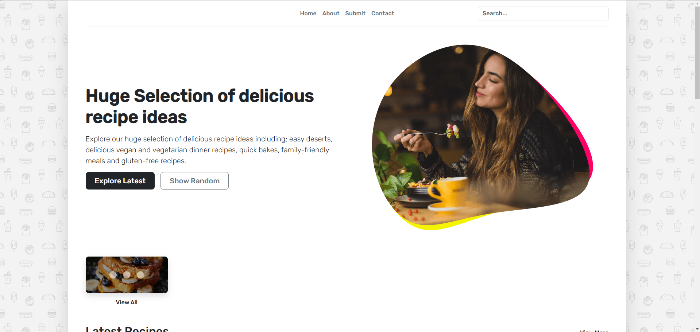
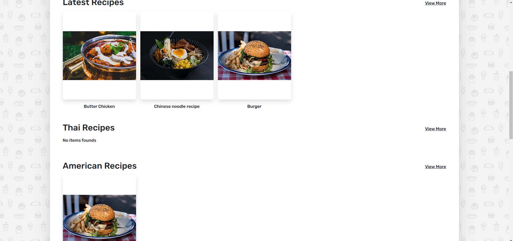
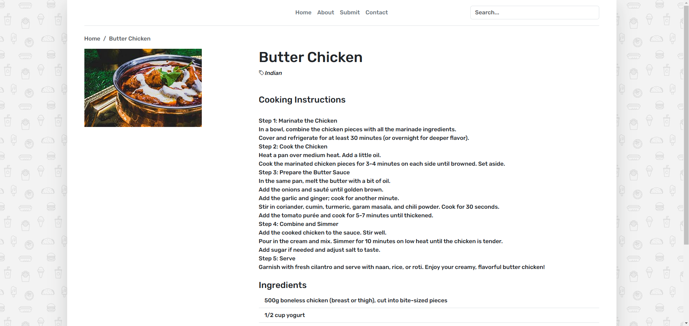
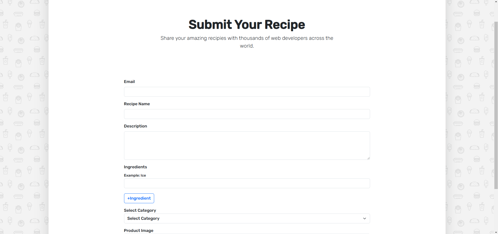

# Cooking Blog

CookingBlog is Built using Node.js for server-side scripting, Express for handling routes and server configuration, and MongoDB for data storage, this project provides an intuitive platform for users to read, search, and submit their favorite recipes.
## Installation 🚀

 Prerequisites

- Node.js (v14 or higher)
- MongoDB

1. Clone the repository:
```bash
git clone https://github.com/anupprasad1802/CookingBlog.git
cd pharmaflow
```

2. Install dependencies:
```bash
npm install
```

3. Create a `.env` file in the root directory with the following variables:
```
MONGODB_URI=your_mongodb_connection_string
```

4. Start the development server:
```bash
npm run dev
```

The application will start running on `http://localhost:3000`

## Screenshots 📸


<br>


<br>

<br>



